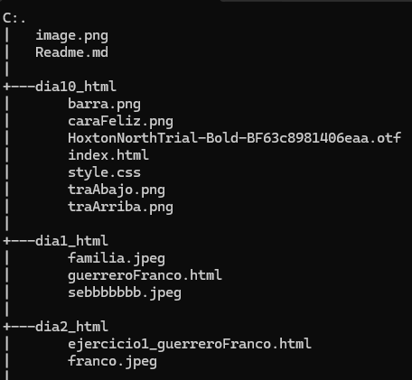
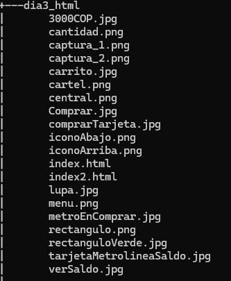
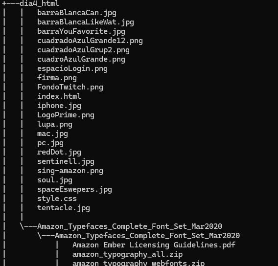
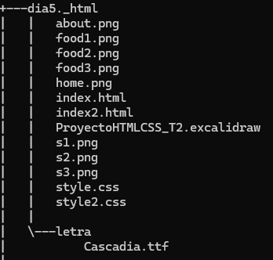
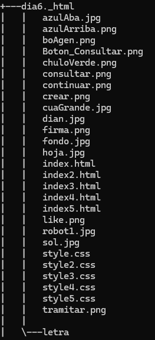
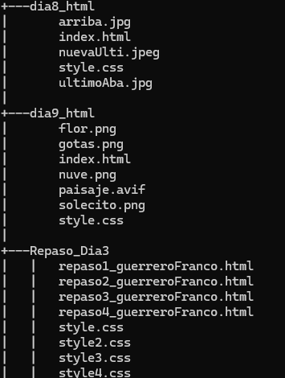
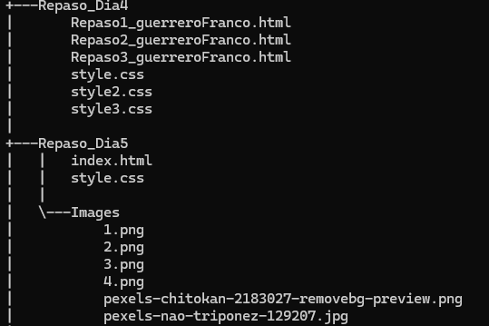
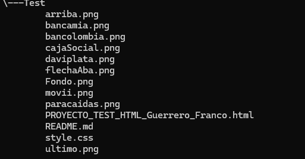

# Html_guerreroFranco 

Este es un repositorio donde se encuentran diferentes carpetas que contienen maquetas de paginas web, animaciones utilizando Html y css 

## Decripcion 
### Dia 1 
realizacion de presentacion sobre mi proyecto de vida en donde presente:  
- quien soy
- mis experiencias recientes
- mi visualizacion 
- funsion sobre mi 
- mis experiencias 

### Dia 2 
Realizacion de mi hoja de vida donde se encuentra:
- informacion personal 
- mis habilidades 
- proyectos personales 
- contactos 

### Dia 3 
Realizacion de maquetacion de pagina de metroLine donde contiene:
- Imagenes relacionadas 
- Hipervinculos 

### Dia 4 
Relizacion de maquetacion de pagina de amazon Prime cotiene:
- imagenes 
- fuentes respectivas
- pequeño Responsive

### Dia 5
Realizacion de maquetacion de pagina de comida que cuenta con:
- Menus 
- Imagenes 
- Hipervinculos 

### Dia 6
Realizacion de maquetacion de pagina de la DIAN, cuenta con:
- Inputs interactivos 
- imagenes 
- Hipervinculos 

### Dia 7 
Realizacion de maquetacion de reponsive de pagina de amazon prime cuenta con:
- imagenes 
- Responsive 

### Dia 8 
Realizacion de maquetacion sobre pagina de extincion, cuenta con:
- grillas 
- imagenes 
- videos autoreproducidos 

### Dia 9 
Realizacion de reto de animaciones, cuenta con:
- imagenes con movimento conforme a la animacion 

### Dia 10 
Realizacion de la maquetacion de pagina Adminsite, cuenta con:
- Menu hamburguesa 
- fuentes respectivas 
- imagenes 

### Test 
Realizacion de maquetacion de pagina de ingreso solidario, cuenta con:
- Inputs interactivos 
- imagenes 
- fuentes respectivas 

### Repaso Dia 3
Realizacion de animaciones, cuenta con:
- 3 animaciones 
- Imagenes

### Repaso Dia 4 
- Reaizacion de reto de animaciones utilizando solo las funciones del css y de html 

### Repaso Dia 5
Realizacion de maquetacion de pagina de cafeteria, cuenta con: 
- Imagenes 
- fuentes respectivas 
- funciones del css

## Lenguajes usados
- HTML 5
- CSS3

## Estructuras del repositorio 
- 
- 
- 
- 
- 
- 
- 
- 

## Caracteristicas
- Archivo con etiqueta HTML contienen la base de las maquetas 
- Archivos css contienen diseños en codigo de las paginas

## Instrucciones 
- Para hacer uso de las paginas se deben abrir desde los index principales o que finalicen con la etiqueta html
- Hacer una descarga o clonar este repositorio
 
## Desarrolado por 
Repositorio desarrolado por jean franco guerrero acero. Estudiante de Campuslands 